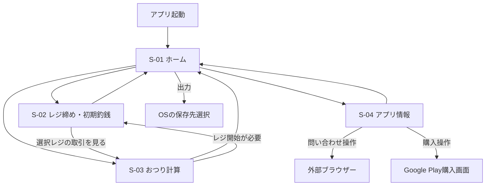

# ウバレジ 基本設計書

| 項目 | 内容 |
| --- | --- |
| 文書番号・版 | 10 / 0.3 |
| 作成日・技術情報の確認日 | 2026-09-07 |
| 対象 | Android試作版と将来のGoogle Play公開に向けた構成 |
| 上位文書 | [00_企画書](00_企画書.md) |
| 下位文書 | [20_詳細設計書](20_詳細設計書.md) |

本書は初期実装方針を定める。公式情報に基づく外部条件と、本アプリ独自の設計上の選択を区別して記載する。

## 1. 対応環境

| 項目 | 初期仕様 |
| --- | --- |
| 対応OS | 基準日時点の安定版Android 17（API 37） |
| SDK | `minSdk = 37` / `targetSdk = 37` / `compileSdk = 37` |
| OSの扱い | Android 17の安定版を検証対象とし、Beta・Canary・将来版を基準にしない |
| 主な端末 | Androidスマートフォン。サイズ変更・横向きでも操作を維持する |
| 言語・通貨 | 日本語 / JPY / 整数円 |
| ユーザー | 1端末につき1人。アプリ内アカウントなし |
| 配布 | 開発後に個人用debug APKで運用。公開を決めた後に署名付きAABを準備 |
| 開発者名 | Mockup |
| 公開版アプリID / namespace | `io.github.mock108.ubaregi` |
| 個人用アプリID | `io.github.mock108.ubaregi.debug`。debugビルドで接尾辞を追加 |
| 初期アプリ版 | versionName `0.1.0` / versionCode `1` |

Android 17は2026-06-16に正式公開された。公式SDK設定はAPI 37を示しているため、「2026-09-07時点の最新Android向け」を上表のように具体化する。[Android 17正式公開](https://developer.android.com/blog/posts/android-17-is-here?hl=en) / [SDK設定](https://developer.android.com/about/versions/17/setup-sdk)

将来版は開発・試験・動作保証の対象外とする。OS更新後に動く可能性まで禁止する意味ではなく、`maxSdkVersion`や将来OSの起動拒否処理は初期実装に追加しない。Android公式も`maxSdkVersion`の指定を推奨していない。[uses-sdkの仕様](https://developer.android.com/guide/topics/manifest/uses-sdk-element)

Android 17では大画面での向き・サイズ固定に制約があるため、縦向き固定に依存せず、余白・スクロール・入力欄の状態保持で対応する。専用のタブレット画面を別途作ることはしない。[Android 17の画面対応](https://developer.android.com/blog/posts/android-17-is-here?hl=en)

## 2. 実装構成

| 要素 | 採用方針 | 目的 |
| --- | --- | --- |
| 言語 | Kotlin | Androidネイティブの小規模アプリとして実装 |
| UI | Jetpack Compose / Material 3 | 4画面と共通入力部品を少ないコードで構築 |
| 画面構成 | 1 Activity、4つの画面遷移先 | 編集や確認は画面内ダイアログに収める |
| 状態管理 | ViewModel / StateFlow / SavedStateHandle | 入力・保存中・履歴表示を分離 |
| 永続化 | Room / SQLite | レジと明細を関連付け、一括更新を保証 |
| 出力 | KotlinによるCSV生成、kotlinx.serializationによるJSON生成 | 同じデータから2形式を生成 |
| ファイル保存 | AndroidのStorage Access Framework | 利用者が保存先を選ぶ |
| 課金 | 個人運用中はSDK未導入。公開準備時にGoogle Play Billing Libraryを追加 | 個人運用の業務機能を先に完成させる |
| 依存の組立て | Application内で明示的に生成 | 初期段階ではDIフレームワークを追加しない |

RoomはローカルSQLiteの読み書きとトランザクションに利用する。[Room公式資料](https://developer.android.com/training/data-storage/room)

構造は単一のアプリモジュールを基本とする。UI → ViewModel → Repository → Roomの流れにし、おつり・レジ集計はAndroidに依存しない計算関数に分ける。出力は小さな専用クラスに分離し、将来の課金導入時も同様とする。独自サーバー、複雑な多層構成、同期処理は設けない。

開発環境の採用基準はAndroid Studio Quail 3（2026.1.3 Patch 1）、AGP 9.3.2、Gradle 9.5.0、JDK 17とする。公式の対応情報とプロジェクト作成手順は[30_開発環境構築手順](30_開発環境構築手順.md)にまとめる。実装時にGradle Wrapperとバージョンカタログへ反映し、初回ビルドで検証する。本書の値は選定済みだが、この時点で開発ツールの導入・アプリのビルドを完了したものではない。

### 2.1 個人運用と公開準備

| 項目 | 個人運用版 | 将来の公開版 |
| --- | --- | --- |
| ビルド種別 | debug | release |
| アプリID | 基本ID + `.debug` | 基本ID |
| ランチャーの名前 | ウバレジ（個人用） | ウバレジ |
| 署名 | SDKが自動作成するdebug署名 | 公開準備時にPlay App Signingとアップロード鍵を設定 |
| 課金 | `BILLING_ENABLED = false`、ボタン非表示、SDK・購入情報の保存処理は未導入 | 商品登録・実装・試験完了後にのみ有効化 |
| プライバシー | 個人運用版の同梱文面 | 課金導入後の実際の取扱いに更新 |

当面は標準のdebug / releaseだけを使用し、product flavorや独立モジュールを追加しない。個人運用版の4画面・金額計算・出力は公開時にも再利用する。

公開用設定の記入先は[release.properties.example](../release.properties.example)とする。現在は見本だけを管理し、将来`release.properties`の読込みを実装する。未作成・空欄でもdebugが動き、releaseの署名や公開に必要な値が不足している場合だけ明確にエラーにする。課金実装前はフラグをtrueにするだけで購入機能が完成した扱いにしない。

個人用と公開版は別アプリとして併存し、DBを共有しない。初期版には復元機能を追加せず、公開版の利用開始時に改めて初期釣銭を登録する。以前の記録は個人用アプリと手動出力で保持する。詳細は[40_公開・運用手順](40_公開・運用手順.md)を参照する。

## 3. 画面構成と遷移

| ID | 画面 | 主な機能 |
| --- | --- | --- |
| S-01 | ホーム | 稼働状態・残高の要約、3画面への遷移、JSON / CSV出力 |
| S-02 | レジ締め / 初期釣銭金額入力 | 開始、補充・取出し、締め、レジ履歴一覧・編集・クリア |
| S-03 | おつり計算電卓 | 商品金額・受取金額入力、おつり表示、取引保存、履歴表示・編集 |
| S-04 | アプリ情報 | バージョン、詳細、プライバシー、OSS情報、Issues、開発支援購入 |

OSの保存先選択、ブラウザー、Google Playの画面はアプリ内4画面に含めない。履歴編集・消去確認・購入額の確認はダイアログまたはボトムシートとし、独立画面を増やさない。

## 4. レジの業務モデル

### 4.1 レジと明細

- レジ：開始時の初期釣銭から締めまでの稼働単位。
- 現金受渡し明細：商品金額、受取金額からおつりと現金増加を計算する。
- 補充・取出し明細：顧客との取引以外に手元現金を増減した記録。
- 締め結果：予定残高、実際の残高、過不足、次回に残す釣銭、取出額。

同時に開けるレジは1つだけ。レジ未開始でも電卓として計算できるが、明細の保存はレジ開始後に限る。日付ではなくレジIDで明細をまとめる。

### 4.2 状態

| 状態 | できること | 制約 |
| --- | --- | --- |
| 未開始 | 初期釣銭入力、計算のみ、過去履歴閲覧・編集、出力 | 新規明細保存不可 |
| OPEN（稼働中） | 明細追加・編集・取消、補充・取出し、初期釣銭修正、締め | 別レジの開始不可 |
| CLOSED（締め済み） | 履歴閲覧・修正、既存明細の編集・取消、出力 | 新規明細追加・再オープンは初期対象外 |

レジ締め後の編集は元の締め日時を維持し、修正日時と版番号を更新する。編集前の全履歴を残す監査ログは試作では設けない。

### 4.3 計算定義

集計対象は対象レジの取消されていない明細だけとする。

| 記号 | 意味 | 計算 |
| --- | --- | --- |
| F | 初期釣銭 | 開始時の入力 |
| A | 1件の商品金額 | Uber側で確認した実際の現金請求額を入力 |
| P | 1件のお客様支払金額 | 実際に受け取った額を入力 |
| C | 1件のおつり | `P - A`。`P < A`は保存不可 |
| K | 現金回収額 | `Σ(P - C) = ΣA` |
| I / O | 途中の補充額 / 取出額 | 該当する明細の合計 |
| E | 予定残高 | `F + K + I - O` |
| R | 実残高 | 締め時に数えた現金。締め時の取出し前の額 |
| D | 現金過不足 | `R - E`。正は超過、負は不足 |
| G | 手元現金の増減 | `R - F`。配達報酬・利益ではない |
| N | 次回釣銭 | 締め時に指定。`0 <= N <= R` |
| W | 締め時の取出額 | `R - N` |

例：F=10,000円、A=1,500円、P=2,000円ならC=500円。補充・途中取出しがなければE=11,500円。実残高R=11,400円ならD=-100円。N=10,000円を残すとW=1,400円となる。

締め時のWを途中取出しOとして追加しない。次のレジのFにNをコピーすることで、同じ資金移動を二重計上しない。NをRより多くしたい場合は、締める前に実際の補充とその記録を行う。

### 4.4 過去修正と次回への引継ぎ

初期釣銭の候補は、開始順で最後の締め済みレジのNとする。候補の確認後に開始し、新しいレジのFとして値をコピーする。最初のレジは未入力から開始する。

過去の明細やFを修正したら、そのレジの集計を再計算する。RとNは観測・指定した値として維持し、修正後の過不足を表示する。後続レジのFを自動変更しない。Rを修正してNがRを超えた場合は、Nも適正値に直さなければ保存しない。

## 5. データ設計の方針

| データ | 保存内容 |
| --- | --- |
| DatasetMeta | 端末内データ集合のID、全体版番号、レジ連番 |
| RegisterSession | レジID、開始順、状態、初期釣銭、締め入力、各日時、版番号 |
| CashEntry | 明細ID、所属レジ、種別、入力金額、時刻、取消状態、版番号 |
| PurchaseProcessing（将来） | 公開版の課金導入時に追加する未処理購入情報。個人運用版では作成しない |

おつり・合計・過不足などの算出値は原則DBに重複保存せず、保存済み入力値から再計算する。JSON / CSVには加工しやすいよう算出値も添える。

- 金額はKotlinの`Long`、SQLiteの`INTEGER`とし、浮動小数点を使わない。
- 1回の入力は0〜9,999,999円。商品金額と補充・取出しは1円以上とする。
- 集計値は符号付き整数円とし、加減算時にオーバーフローを検出する。
- IDはUUID。作成・修正日時はUTCで保存し、画面は日本時間（Asia/Tokyo）で表示する。
- 端末時計の変更で並びが逆転しないよう、レジ・明細の連番を別に保持する。
- 新規保存、編集、取消、締め、全消去はそれぞれDBトランザクションで完結させる。
- アプリ内の全履歴クリアは業務データを対象とし、Google Play上の購入は取り消さない。

## 6. 通信と保存先

### 6.1 承認済みの通信例外

2026-09-07の確認により、購入・問い合わせ時だけの通信を認める。

| 操作 | 通信・データの扱い |
| --- | --- |
| 起動、ホーム、計算、保存、編集、締め、履歴 | 通信しない。課金接続も起動しない |
| アプリ情報を表示するだけ | 同梱した文章を表示。商品価格の自動取得や外部ページ取得をしない |
| 「開発を応援する」「購入状況を確認」（将来） | 個人運用版では非表示。公開版で有効化後、Google Playへ接続して処理する |
| 「GitHubで問い合わせ」 | 外部ブラウザーに固定URLを渡す。明細・金額をURLへ付加しない |
| CSV / JSON出力 | アプリから独自サーバーへの送信はしない。指定された保存先へ書き込む |

購入の保留・失敗後は、利用者が再度購入確認を操作して処理を再開する。自動の定期通信・バックグラウンドジョブは設けない。

### 6.2 ローカルデータの保護

業務DBと未処理購入情報はアプリ専用内部領域に保存する。ログ、解析SDK、Crashlytics等に業務データを送らない。独自の暗号化・PIN画面は初期実装に追加せず、Androidのアプリ分離と端末保護を利用する。

`android:allowBackup="false"`に加え、`dataExtractionRules`でクラウドバックアップ・端末間転送・対応するクロスプラットフォーム転送から業務DBと設定を明示的に除外する。購入処理用ファイルも除外する。`noBackupFilesDir`も利用し、実装時の保存パスとルールを照合する。一部端末では`allowBackup`だけで端末移行を止められないため、対象端末で確認する。[Androidのバックアップ仕様](https://developer.android.com/identity/data/autobackup)

アンインストール・アプリデータ消去・端末故障により内部データは失われる。手動出力は可能だが、試作には再取込・自動復元を設けない。通常の履歴消去はアプリ上の論理的な消去であり、記憶媒体の完全消去は保証しない。

### 6.3 権限

位置情報、連絡先、カメラ、電話、通知、広範なストレージ権限を要求しない。保存にはStorage Access Frameworkを使い、問い合わせは外部ブラウザーに委譲する。[ファイル保存の公式資料](https://developer.android.com/training/data-storage/shared/documents-files)

独自HTTP通信は実装しない。Billing Libraryが追加する権限・コンポーネントを含め、最終的に統合されたManifestを確認する。`INTERNET`権限の有無だけで「通信なし」を証明したことにはしない。

## 7. CSV / JSON出力

- 独自フォーマットv1として、現在保存されている全レジ・全明細を出力する。
- 締め前のレジ、取消済み明細も状態付きで出力し、外部側が確定・除外を判断できるようにする。
- CSVは1ファイル・固定列でレジ行と明細行を区別する。JSONはメタ情報・レジ配列・明細配列で構成する。
- 同じ時点のDBスナップショットから作成し、出力中の編集を途中に混ぜない。
- UTF-8を使用し、CSVにはBOMを付ける。金額は通貨記号・桁区切りなしの整数円。
- 全体の版番号・IDを付ける。再出力・修正を単純に追加取込すると二重になるため、外部加工側は全量スナップショットとして扱う。
- 購入情報、端末識別子、顧客情報、認証情報を含めない。
- 出力は利用者が選んだ保存先に対してのみ行う。ローカル保存を案内し、クラウド提供元を選ぶとその提供元による通信が起こり得ることを伝える。

ホームには別途開発する変換サイトへの自動アップロード機能を設けない。項目・型・空欄・取消・集計の契約は詳細設計書を正とする。

## 8. 開発支援購入

本節は将来の公開版に向けた仕様とする。個人運用中は`BILLING_ENABLED = false`を固定し、SDK・通信・購入処理を導入しない。

1種類の消費型1回購入商品とし、商品IDは`developer_support`、表示名は「開発支援（任意）」、日本の設定希望価格は100円とする。実際の表示価格は公開準備時に登録したGoogle Playの商品情報から取得する。購入しない利用者に制限を設けない。

支援は非課税寄付として案内しない。チップの条件や支払い分類はGoogle Playのポリシーで確認し、公開前に商品と説明文が適合することを確認する。本設計だけで審査通過を保証した扱いにしない。[支払いポリシー](https://support.google.com/googleplay/android-developer/answer/9858738?hl=en) / [チップ等の説明](https://support.google.com/googleplay/android-developer/answer/10281818?hl=en)

購入確認は安全なサーバーによる検証が公式に推奨されている。本アプリではサーバーを持たない要件を優先し、クライアント側で購入情報・状態・署名を確認して消費処理を行う。特権を付与しない構成でもサーバー検証と同等の不正検知はできない、という制約を受け入れる。[購入のセキュリティ](https://developer.android.com/google/play/billing/security)

購入済み状態のみ処理し、保留中を成功扱いしない。消費処理は購入確認を兼ねる。購入確認期限は原則購入成立から3日で、未確認だと自動返金されるため、中断からの回復を試験する。通信を利用者操作時に限る設計では、利用者が戻らず期限切れになる場合がある。[Billingの購入処理](https://developer.android.com/google/play/billing/integrate?hl=en)

## 9. 非機能要件

| 分類 | 初期基準 |
| --- | --- |
| 操作性 | 数字入力を中心にし、おつりを大きく表示。保存は明示操作 |
| アクセシビリティ | 48dp以上のタップ領域、文字拡大、読み上げ用ラベル、色だけに頼らない状態表示 |
| 応答 | 対象実機で計算結果は入力後100ms以内、通常保存は1秒以内を目標に測定 |
| 履歴量 | 1万明細を初期検証量とする。件数による有料制限は設けない |
| 大量データ | 履歴は遅延表示・ページ取得。出力はIO処理で行い、UIを止めない |
| 保存整合性 | 成功表示はDB確定後。連打・画面復帰・再試行で重複登録しない |
| 中断 | 保存済みデータを維持。未保存入力は保存済みと誤認させない |
| 障害 | 保存失敗時は入力を残し、再試行可能にする。破損時にDBを勝手に作り直さない |
| 更新 | DBスキーマ変更にはマイグレーションを設ける。破壊的移行をしない |
| 検証 | 金額計算、保存の原子性、編集後の集計、出力、購入中断を重点確認 |

これらは設計目標であり、本書作成時点で測定・実装を完了したことを示すものではない。

## 10. Google Play公開に向けた準備

以下は個人運用後に公開を決めた時の作業とする。現段階では開発者登録・本人確認、公開用鍵の生成、課金商品登録、外部サイトの公開設定、ストア申請を行わない。後日用の設定欄・作業順序は[40_公開・運用手順](40_公開・運用手順.md)に用意する。

公開直前に改めて現行条件を確認する。基準日時点では2026-08-31以降の通常の新規アプリ・更新はtarget API 36以上が必要で、本設計の37はこれを満たす。[Target API要件](https://support.google.com/googleplay/android-developer/answer/11926878?hl=en)

| 項目 | 実施内容 |
| --- | --- |
| アプリ登録 | `io.github.mock108.ubaregi`、開発者Mockup、日本・日本語、無料、カテゴリ「ツール」を設定。登録可能性と実態を確認 |
| 配布物 | 署名付きAABとPlay App Signingを設定。秘密鍵は公開リポジトリから分離 |
| 説明・画像 | 4画面の実画面、対応OS、全機能無料、任意購入、非公式である旨を記載 |
| プライバシー | [50_プライバシーポリシー](50_プライバシーポリシー.md)を同梱。公開時に課金の取扱いを反映し、公開HTTPS URLを設定 |
| データセーフティ | 実際の処理と組込みSDKを確認して回答。「ローカルだから無条件に収集なし」と決めない |
| コンテンツ申告 | 広告なし、アプリ内購入あり、対象年齢・コンテンツレーティング等を実態どおりに申告 |
| 問い合わせ | Issues URLとストアに必要な連絡先を整備。未設定の仮URLを公開しない |
| 課金 | 商品設定、テスト購入、保留・取消・再購入・中断回復を確認 |
| OSS | 自作部分はMIT。[LICENSE](../LICENSE)の著作権表示・許諾文を配布物に同梱。依存ライセンス表示、秘密情報・実データの混入を確認 |
| テスト公開 | 内部テスト後、アカウントに適用されるクローズドテスト等を実施 |

データを収集しないアプリでもプライバシーポリシーとデータセーフティ申告の準備が必要である。ポリシーはデータの保存・削除と課金・問い合わせを含めて説明する。[データセーフティ](https://support.google.com/googleplay/android-developer/answer/10787469?hl=en) / [ユーザーデータポリシー](https://support.google.com/googleplay/android-developer/answer/10144311?hl=en)

2023-11-13以降に作成された個人アカウントには、原則12人以上が14日間連続で参加するクローズドテスト等の要件がある。該当性をPlay Consoleで確認する。[個人アカウントのテスト要件](https://support.google.com/googleplay/android-developer/answer/14151465?hl=en)

設計書は公開リポジトリ[mock108/ubaregi](https://github.com/mock108/ubaregi)の`doc`で管理する。自作部分のライセンスはMITで確定済みとし、アプリ情報画面でも同梱した著作権表示とライセンス全文を表示する。アプリ登録、購入商品の有効化、ストア申請は実装・公開準備の段階で行う。
